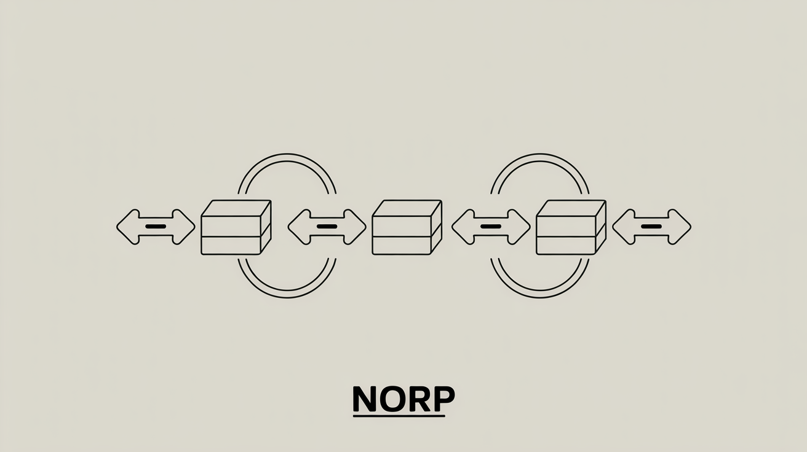

<div align="center">



# NORP - NeuraScope Orchestration Reference Patterns

**Open Standards for Production-Grade AI Orchestration**

[](https://creativecommons.org/licenses/by/4.0/)
[](https://opensource.org/licenses/MIT)
[](./specs/)
[](./AUDIT-REPORT.md)

</div>

---

## Vue d'ensemble

Ce dépôt contient les spécifications normatives **NORP** (NeuraScope Orchestration Reference Patterns), un ensemble de standards ouverts pour l'orchestration IA en production.

**Statut** : ✅ **Phase 1 + Phase 2 COMPLETE** (7 specs STABLE + 3 implémentations)

**Licence** : CC BY 4.0 (spécifications) + MIT (implémentations de référence)

---

## Objectif

NORP définit des invariants architecturaux et opérationnels pour garantir :
- **Sécurité** : Isolation multi-tenant stricte
- **Fiabilité** : Validation fail-fast pré-exécution
- **Prévisibilité** : Déterminisme et traçabilité
- **Performance** : Algorithmes O(V+E) scalables

---

## Standards disponibles

| NORP | Titre | Statut | Version |
|------|-------|--------|---------|
| [NORP-001](./specs/NORP-001.md) | Pre-Execution Validation Pipeline | ✅ **Stable** | **1.2** |
| [NORP-002](./specs/NORP-002.md) | Multi-Tenant Resource Isolation | ✅ **Stable** | **1.2** |
| [NORP-003](./specs/NORP-003.md) | Immutable Pipeline with DTOs | ✅ **Stable** | **1.2** |
| [NORP-004](./specs/NORP-004.md) | Cycle Detection in Directed Graphs | ✅ **Stable** | **1.2** |
| [NORP-005](./specs/NORP-005.md) | Topological Sorting for Execution Order | ✅ **Stable** | **1.2** |
| [NORP-006](./specs/NORP-006.md) | Resource Pooling with Context Isolation | ✅ **Stable** | **1.2** |
| [NORP-007](./specs/NORP-007.md) | Cost Estimation Pre-Execution | ✅ **Stable** | **1.2** |

---

## Structure du dépôt

```
NORP/
├── README.md                          # Ce fichier
├── specs/                             # Spécifications normatives
│   ├── NORP-001.md                   # Validation Pipeline
│   ├── NORP-002.md                   # Multi-Tenant Isolation
│   ├── NORP-003.md                   # Immutable Pipeline
│   ├── NORP-004.md                   # Cycle Detection
│   ├── NORP-005.md                   # Topological Sorting
│   ├── NORP-006.md                   # Resource Pooling
│   └── NORP-007.md                   # Cost Estimation
├── reference-implementations/         # Implémentations de référence
│   ├── php/                          # Laravel/PHP
│   │   ├── BlueprintValidator.php
│   │   ├── BlueprintCompiler.php
│   │   ├── ContextManager.php
│   │   └── DTOs/
│   ├── typescript/                   # TypeScript (planifié)
│   └── python/                       # Python (planifié)
├── compliance-tests/                  # Suite de tests conformité
│   ├── NORP-001-tests.md
│   ├── NORP-002-tests.md
│   └── test-runner.md
├── examples/                          # Exemples non-normatifs
│   ├── simple-workflow.json
│   ├── multi-tenant-workflow.json
│   └── llm-orchestration.json
└── governance/                        # Gouvernance NORP
    ├── CONTRIBUTING.md
    ├── REVIEW-PROCESS.md
    └── ROADMAP.md
```

---

## Utilisation

### Pour implémenter NORP dans votre système

1. Lire les spécifications dans `specs/`
2. Consulter les implémentations de référence dans `reference-implementations/`
3. Exécuter les tests de conformité dans `compliance-tests/`

### Pour contribuer aux standards

1. Lire `governance/CONTRIBUTING.md`
2. Proposer modifications via Pull Request
3. Suivre le processus de revue dans `governance/REVIEW-PROCESS.md`

---

## Principes fondateurs

### 1. **Standards basés sur code production**
Chaque NORP est extrait de code NeuraScope **déjà en production**, pas de théorie.

### 2. **Testabilité obligatoire**
Chaque NORP inclut une suite de tests de conformité exécutables.

### 3. **Implémentations de référence**
Code réutilisable fourni sous licence MIT pour faciliter l'adoption.

### 4. **Pas de vendor lock-in**
Les specs sont agnostiques technologie/langage/framework.

---

## Roadmap

### Phase 1 : Spécifications fondamentales (Q1 2026) - EN COURS
- ✅ **NORP-001 v1.2 STABLE** (2026-01-09)
- ✅ **NORP-002 v1.2 STABLE** (2026-01-09)
- ✅ **NORP-003 v1.2 STABLE** (2026-01-09)
- ✅ **NORP-004 v1.2 STABLE** (2026-01-09)
- ✅ **NORP-005 v1.2 STABLE** (2026-01-09)
- ✅ **NORP-006 v1.2 STABLE** (2026-01-09)
- ✅ **NORP-007 v1.2 STABLE** (2026-01-09)
- ✅ **Phase 1 TERMINÉE** (7/7 specs STABLE)
- 🔄 Revue communauté
- ✅ Tests conformité (NORP-001, NORP-002, NORP-003, NORP-004, NORP-005, NORP-006, NORP-007)

### Phase 2 : Implémentations multi-langages (Q2 2026)
- 🔄 PHP (extraction depuis NeuraScope)
- ⏳ TypeScript
- ⏳ Python

### Phase 3 : Adoption externe (Q3 2026)
- ⏳ Certification NORP-compliant
- ⏳ Intégrations tierces
- ⏳ Workshops et conférences

---

## Comparaison avec standards existants

| Standard | Scope | NORP avantage |
|----------|-------|---------------|
| **AAIF MCP** | Protocole communication LLM | NORP = Runtime + Validation + Multi-tenant |
| **Airflow** | Batch workflows | NORP = Temps réel + IA probabiliste + Coûts variables |
| **OpenAI Agents SDK** | Framework propriétaire | NORP = Vendor-neutral + Production-ready |

**NORP comble le gap** : Standards pour orchestration IA **multi-tenant sécurisée en production**.

---

## Licence

- **Spécifications** (`specs/`) : [CC BY 4.0](https://creativecommons.org/licenses/by/4.0/)
- **Code de référence** (`reference-implementations/`) : [MIT License](https://opensource.org/licenses/MIT)
- **Tests** (`compliance-tests/`) : [MIT License](https://opensource.org/licenses/MIT)

---

## Contact

- **GitHub** : https://github.com/neurascope/norp-specs
- **Site web** : https://norp.neurascope.ai (à venir)
- **Issues** : https://github.com/neurascope/norp-specs/issues
- **Discussions** : https://github.com/neurascope/norp-specs/discussions
- **Email** : norp@neurascope.ai

---

## Citation

Si vous utilisez NORP dans vos travaux académiques :

```bibtex
@techreport{norp2026,
  title={NORP: NeuraScope Orchestration Reference Patterns},
  author={NORP Working Group},
  institution={NeuraScope},
  year={2026},
  type={Technical Specification},
  url={https://github.com/neurascope/norp-specs}
}
```

---

**NORP** - Standards ouverts pour l'orchestration IA de confiance.

**© 2026 NeuraScope - Propulsé par CONVERWAY**
