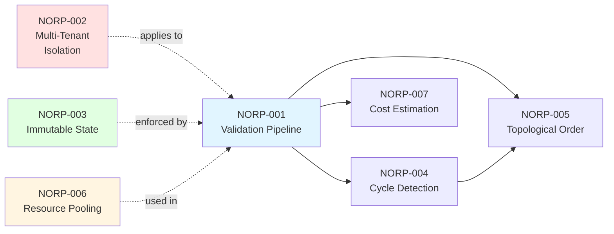

<div align="center">


# NORP - NeuraScope Orchestration Reference Patterns

**Open Standards for Production-Grade AI Orchestration**

[](https://creativecommons.org/licenses/by/4.0/)
[](https://opensource.org/licenses/MIT)
[](./specs/)
[](https://github.com/norp-specs/norp)

</div>

---

## Vue d'ensemble

Ce dépôt contient les spécifications normatives **NORP** (NeuraScope Orchestration Reference Patterns), un ensemble de standards ouverts pour l'orchestration IA en production.

**Statut** : ✅ **Phase 1 + Phase 2 COMPLETE** (8 specs dont 7 STABLE + 3 implémentations)

**Licence** : CC BY 4.0 (spécifications) + MIT (implémentations de référence)

---

## 🎯 Quick Start (30 seconds)

**What is NORP?**
Open standards defining **how to build safe, predictable AI orchestration systems** in production.

**Why NORP?**
Prevents cycles, isolates tenants, controls costs, ensures determinism.

**How to use?**
1. Read [NORP-001](./specs/NORP-001.md) (validation pipeline)
2. Implement using [PHP](./reference-implementations/php/), [Python](./reference-implementations/python/), or [TypeScript](./reference-implementations/typescript/)
3. Pass [compliance tests](./compliance-tests/)

---

## Objectif

NORP définit des invariants architecturaux et opérationnels pour garantir :
- **Sécurité** : Isolation multi-tenant stricte
- **Fiabilité** : Validation fail-fast pré-exécution
- **Prévisibilité** : Déterminisme et traçabilité
- **Performance** : Algorithmes O(V+E) scalables

---

## Standards disponibles

### Architecture Overview



### Specifications List

| NORP | Titre | Statut | Version |
|------|-------|--------|---------|
| [NORP-001](./specs/NORP-001.md) | Pre-Execution Validation Pipeline | ✅ **Stable** | **1.2** |
| [NORP-002](./specs/NORP-002.md) | Multi-Tenant Resource Isolation | ✅ **Stable** | **1.2** |
| [NORP-003](./specs/NORP-003.md) | Immutable Pipeline with DTOs | ✅ **Stable** | **1.2** |
| [NORP-004](./specs/NORP-004.md) | Cycle Detection in Directed Graphs | ✅ **Stable** | **1.2** |
| [NORP-005](./specs/NORP-005.md) | Topological Sorting for Execution Order | ✅ **Stable** | **1.2** |
| [NORP-006](./specs/NORP-006.md) | Resource Pooling with Context Isolation | ✅ **Stable** | **1.2** |
| [NORP-007](./specs/NORP-007.md) | Cost Estimation Pre-Execution | ✅ **Stable** | **1.2** |
| [NORP-008](./specs/NORP-008.md) | NORP Interface Specification | 🔄 Draft | 1.0 |

### Languages

NORP specifications are available in:
- 🇬🇧 **English** (specs/NORP-*.md) - Original version
- 🇫🇷 **Français** (specs/fr/NORP-*.md) - Complete translation

---

## Structure du dépôt

```
NORP/
├── README.md                          # Ce fichier
├── specs/                             # Spécifications normatives
│   ├── NORP-001.md à 007.md          # 7 specs STABLE
│   ├── NORP-008.md                   # Interface spec (DRAFT)
│   └── fr/                           # Traductions françaises
├── schemas/                           # JSON Schema
│   ├── norp-interface.schema.json    # Validation NORP-008
│   └── norp-interface.template.json  # Template starter
├── reference-implementations/         # Implémentations de référence
│   ├── php/                          # PHP 8.2+
│   ├── python/                       # Python 3.10+
│   └── typescript/                   # TypeScript 5.0+
├── compliance-tests/                  # Suite de tests conformité
│   └── NORP-001-tests.md à 008-tests.md
├── examples/                          # Exemples
│   ├── interfaces/                   # NORP-008 interfaces
│   ├── saas/                         # Use case SaaS
│   ├── simple-workflow.json
│   └── multi-tenant-workflow.json
└── governance/                        # Gouvernance NORP
    ├── CONTRIBUTING.md
    ├── CODE_OF_CONDUCT.md
    └── ROADMAP.md
```

---

## Utilisation

### Pour implémenter NORP dans votre système

1. Lire les spécifications dans `specs/`
2. Consulter les implémentations de référence dans `reference-implementations/`
3. Exécuter les tests de conformité dans `compliance-tests/`

### Pour contribuer aux standards

1. Lire `governance/CONTRIBUTING.md`
2. Proposer modifications via Pull Request
3. Suivre le processus de revue dans `governance/REVIEW-PROCESS.md`

---

## Principes fondateurs

### 1. **Standards basés sur code production**
Chaque NORP est extrait de code NeuraScope **déjà en production**, pas de théorie.

### 2. **Testabilité obligatoire**
Chaque NORP inclut une suite de tests de conformité exécutables.

### 3. **Implémentations de référence**
Code réutilisable fourni sous licence MIT pour faciliter l'adoption.

### 4. **Pas de vendor lock-in**
Les specs sont agnostiques technologie/langage/framework.

---

## Roadmap

### Phase 1 : Spécifications fondamentales (Q1 2026) - EN COURS
- ✅ **NORP-001 v1.2 STABLE** (2026-01-09)
- ✅ **NORP-002 v1.2 STABLE** (2026-01-09)
- ✅ **NORP-003 v1.2 STABLE** (2026-01-09)
- ✅ **NORP-004 v1.2 STABLE** (2026-01-09)
- ✅ **NORP-005 v1.2 STABLE** (2026-01-09)
- ✅ **NORP-006 v1.2 STABLE** (2026-01-09)
- ✅ **NORP-007 v1.2 STABLE** (2026-01-09)
- ✅ **Phase 1 TERMINÉE** (7/7 specs STABLE)
- 🔄 Revue communauté
- ✅ Tests conformité (NORP-001, NORP-002, NORP-003, NORP-004, NORP-005, NORP-006, NORP-007)

### Phase 2 : Implémentations multi-langages
- ✅ **PHP** (6 fichiers, production-tested)
- ✅ **Python** (5 fichiers)
- ✅ **TypeScript** (6 fichiers)
- ✅ **Phase 2 TERMINÉE**

### Phase 3 : Adoption externe (Q3 2026)
- ⏳ Certification NORP-compliant
- ⏳ Intégrations tierces
- ⏳ Workshops et conférences

---

## Comparaison avec standards existants

| Standard | Scope | NORP avantage |
|----------|-------|---------------|
| **AAIF MCP** | Protocole communication LLM | NORP = Runtime + Validation + Multi-tenant |
| **Airflow** | Batch workflows | NORP = Temps réel + IA probabiliste + Coûts variables |
| **OpenAI Agents SDK** | Framework propriétaire | NORP = Vendor-neutral + Production-ready |

**NORP comble le gap** : Standards pour orchestration IA **multi-tenant sécurisée en production**.

---

## Licence

- **Spécifications** (`specs/`) : [CC BY 4.0](https://creativecommons.org/licenses/by/4.0/)
- **Code de référence** (`reference-implementations/`) : [MIT License](https://opensource.org/licenses/MIT)
- **Tests** (`compliance-tests/`) : [MIT License](https://opensource.org/licenses/MIT)

---

## Contact

- **GitHub** : https://github.com/norp-specs/norp
- **Site web** : https://norp.neurascope.ai (à venir)
- **Issues** : https://github.com/norp-specs/norp/issues
- **Discussions** : https://github.com/norp-specs/norp/discussions
- **Email** : norp@neurascope.ai

---

## Citation

Si vous utilisez NORP dans vos travaux académiques :

```bibtex
@techreport{norp2026,
  title={NORP: NeuraScope Orchestration Reference Patterns},
  author={NORP Working Group},
  institution={NeuraScope},
  year={2026},
  type={Technical Specification},
  url={https://github.com/norp-specs/norp}
}
```

---

**NORP** - Standards ouverts pour l'orchestration IA de confiance.

**© 2026 NeuraScope - Propulsé par CONVERWAY**
